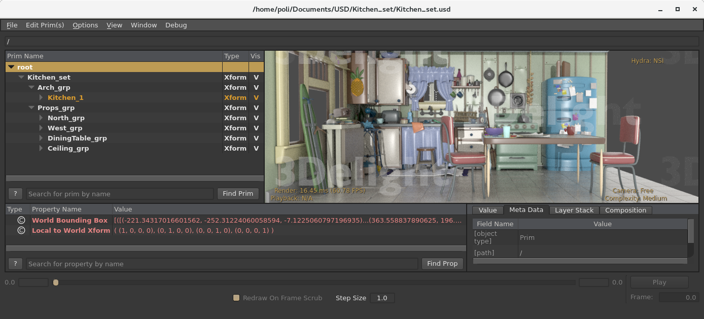

# HydraNSI (hdNSI)

This repository contains a render delegate for Hydra using the NSI technology.



| Kitchen | Hair | Points |
| -------- | -------- | -------- | 
|  |    |   |


## Background

**Hydra**
Pixar USD (Universal Scene Description) introduced a model/API called Hydra (allegedly named after the multi-headed monster in Greek mythology). Hydra allows different sources of graphic data (indeed called "heads") to produce images of a 3D scene via rendering backends which receive live data updates (scene edits).

> https://github.com/PixarAnimationStudios/USD

**NSI**
NSI (Nodal Scene Interface) is a simple and flexible scene description API which is purposely designed to communicate with a render engine. It is used by the new 3Delight NSI renderer together with OSL (Open Shading Language) for shading. One of the goals of NSI is interactive rendering of editable scene descriptions: this feature, as well as many other, make NSI a perfect candidate for a Hydra rendering backend which we call HydraNSI (*hdNSI*). 

> https://gitlab.com/3DelightOpenSource/HydraNSI/blob/master/nsi.pdf

HydraNSI can be easily compiled as a plug-in part of the USD toolset. It can naturally be used by any current and future application that implements the USD API as a data model, and which uses Hydra for visualization. As a practical example, it can be added to the USD viewing utility **usdview**.

## Demo Video 


And other 8 videos here:

https://gitlab.com/3DelightOpenSource/HydraNSI/wikis/Videos

## Building
> This code was tested with Pixar USD version 0.8.5a and 3Delight NSI v13.4.9

Once you are able to build Pixar USD, building HydraNSI is very easy:


1. Add the hdNSI folder to your USD distribution, the injection point being:
  https://github.com/PixarAnimationStudios/USD/tree/master/pxr/imaging/plugin
  
2. Make sure to use a CMAKE set to build *hdNSI*:

| CMAKE Variable       | Value     |
| -------------------- | --------- |
| PXR_BUILD_NSI_PLUGIN | 1         |

  
3. Obtain a copy of 3Delight | NSI containing the rendering library, include headers and OSL shaders, then set the following CMAKE variables:

| CMAKE Variable  | Value                       |         |                                                         |
| --------------- | --------------------------- | ------- | ------------------------------------------------------- |
| NSI_INCLUDE_DIR | /path/to/nsi-include-folder | Linux   | /usr/local/3delight-version/Linux_64/include            |
|                 |                             | macOS   | /Applications/3Delight/include                          |
|                 |                             | Windows | C:\Program Files\3Delight\include                       |
| NSI_LIBRARY     | /path/to/nsi-library-file   | Linux   | /usr/local/3delight-version/Linux_64/lib/lib3delight.so |
|                 |                             | macOS   | /Applications/3Delight/lib/lib3delight.dylib            |
|                 |                             | Windows | C:\Program Files\3Delight\lib                           |

## Features

Currently HydraNSI supports the following:

- Geometric primitives:
  - Polygon mesh
  - Subdivision surfaces
  - Points (particles)
  - Curves (hair/fur)
- Instancing of primitives
- Cameras
- Shading:
  - Polygons, subdivisions and points use the *dl3DelightMaterial* material which defaults to a mostly diffusive material (Oren-Nayar model) with a degree of glossy reflection (GGX model).
  - Curves are shaded with the *dlHairAndFur* material (Marschner-Chiang-d'Eon model).
- Lighting:
  - Head light: a directional light that uses a *directionalLight* emitter and which shines from the camera pov. It is always active. Note that in NSI directional lights are actual environment lights: when an angle of 0 degrees is specified they behave directionally. See nsi.pdf for more informations. 
  - Omni environment: this is another directional light that uses another *directionalLight* emitter. It is used when a file texture is not set in the configuration (see below). As per above this is an environment light, though when an angle of 360 degrees it behaves like a uniform environment.
  - HDRI environment: this is a small shading network using *uvCoordEnvironment --> file --> dlEnvironmentShape* which allows to optionally use a HDRI file texture for image-based lighting. It can be enabled via environment variable. Use the HDNSI_ENV_LIGHT_IMAGE environment variable pointing at the file location on disk (.tdl, .exr and .hdr formats are accepted). For more info see: https://gitlab.com/3DelightOpenSource/HydraNSI/blob/master/hdNSI/config.cpp. HDRI environment can be created by using data from http://gl.ict.usc.edu/Data/HighResProbes and then process them as tiled mipmaps using the follwing command: *tdlmake -envlatl filename.exr filename.tdl.tif*
  - Procedural Sky environment: this is a small shading network using *dlSky --> dlEnvironmentShape* which allows to optionally use a HDRI procedural sky (Hosek-Wilkie model) for (procedual) image-based lighting. It can be enabled via environment variable. Use the HDNSI_ENV_USE_SKY environment variable set to 1 to enable the procedual sky environment. For more info see: https://gitlab.com/3DelightOpenSource/HydraNSI/blob/master/hdNSI/config.cpp.

## Testing

From an environment where both `usdview` and the NSI command-line renderer `renderdl` can be executed:

- On your terminal, launch `usdview`:
  
    ```bash
    usdview /path/to/file.usd
    ```
- Switch to View> Hydra Renderer: “NSI”.
- Try loading some USD files, e.g:
  - [Kitchen](http://graphics.pixar.com/usd/files/Kitchen_set.zip)
  - [Instanced city](http://graphics.pixar.com/usd/files/PointInstancedMedCity.zip)
  - [Apple USDZ examples](https://developer.apple.com/arkit/gallery) -- Note that USDZ is basically a zip file with no compression: you can rename the files from .usdz to .zip and unzip them to access the actual .usd files.
- In `usdview` you can set "View> Complexity: Medium" to enable subdivision surfaces. 
- Optionally configure HydraNSI settings via (see: https://gitlab.com/3DelightOpenSource/HydraNSI/blob/master/hdNSI/config.cpp).
- Further explore the source code and issues in this repository & contribute.

> Contributors may contact us at [support@3delight.com](mailto:support@3delight.com) to obtain a copy of 3Delight NSI for development purposes.


## Future

We are looking for community contributions to implement the following:

- add **usdShade** schema support for 3Delight OSL materials: [Issue #1](https://gitlab.com/3DelightOpenSource/HydraNSI/issues/1)
- add **usdLux** schema support for 3delight OSL lights: [Issue #2](https://gitlab.com/3DelightOpenSource/HydraNSI/issues/2)
- add upcoming **usdVolume** schema support for 3Delight OpenVDB volumes: [Issue #3](https://gitlab.com/3DelightOpenSource/HydraNSI/issues/3)
- add OSL matching shaders for **UsdPreviewSurface**: [issue #4](https://gitlab.com/3DelightOpenSource/HydraNSI/issues/4)


## Feedback & Contributions

Feel free to log issues or submit pull requests on this repository. Contributors will added to the be credits.

If you need to get in touch with us e-mail [support@3delight.com](mailto:support@3delight.com)


## Credits

This work was authored by:

**J Cube Inc.** — Marco Pantaleoni, Bo Zhou, Paolo Berto Durante

Copyright © 2018 Illumination Research Ptv Ltd.


## License

Apache 2.0
